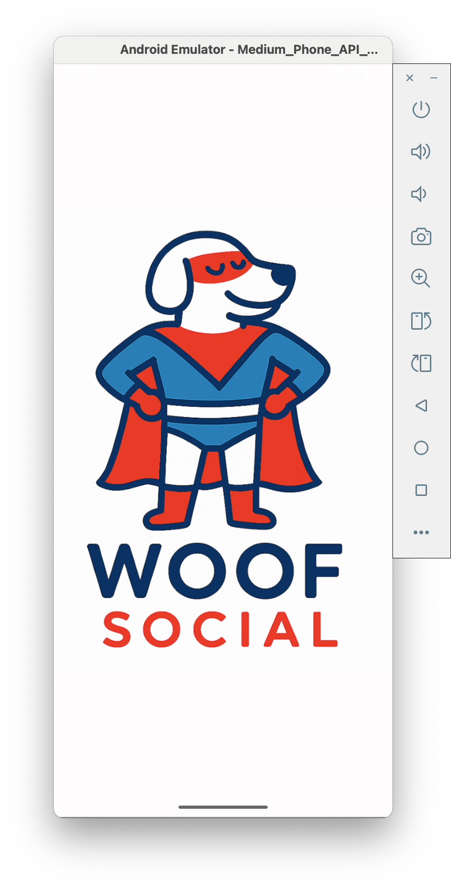
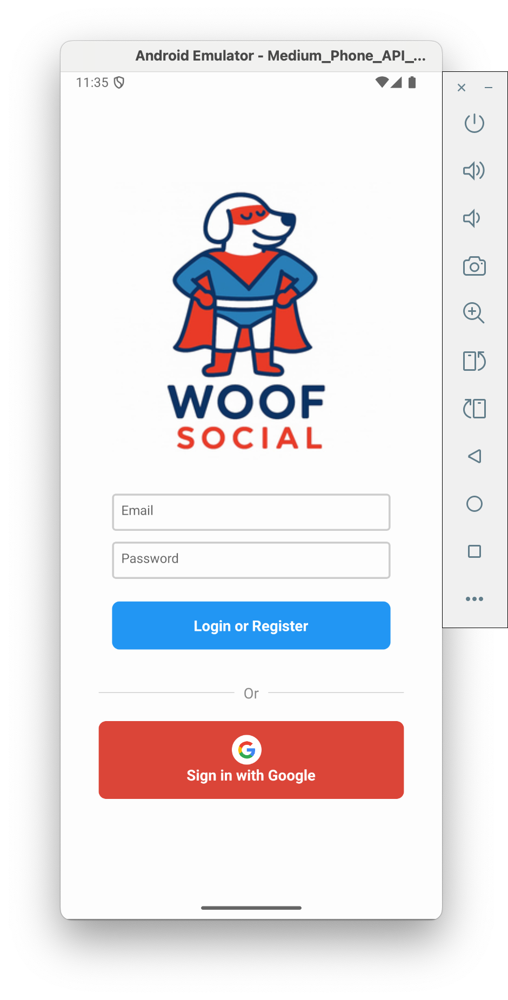
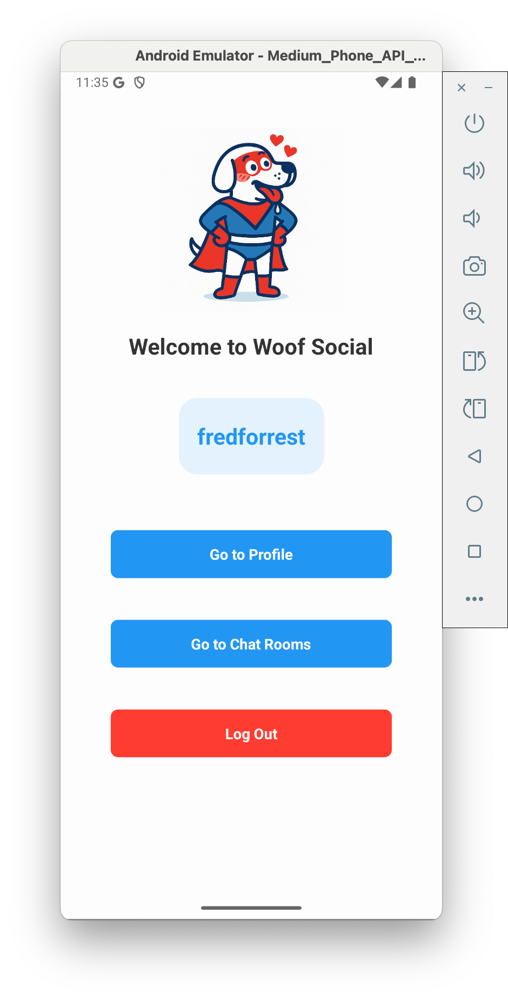
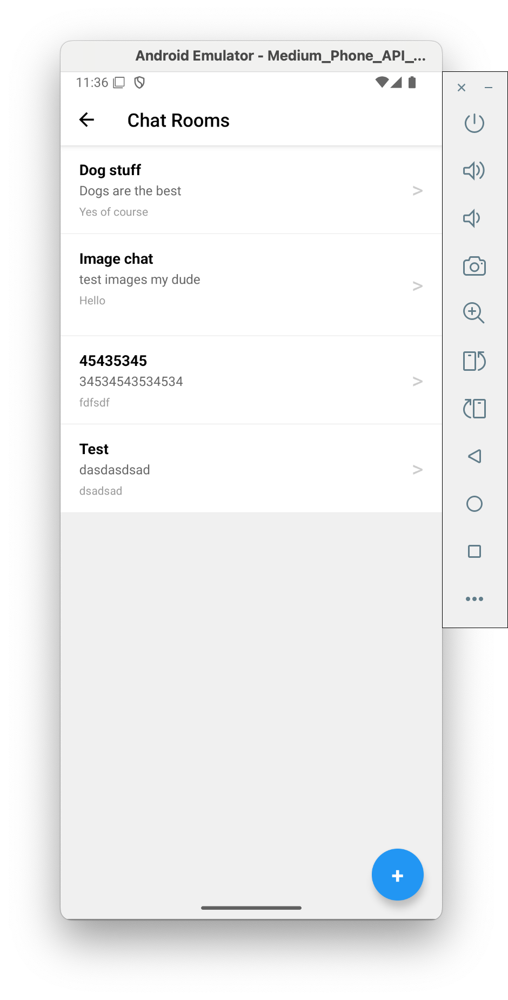
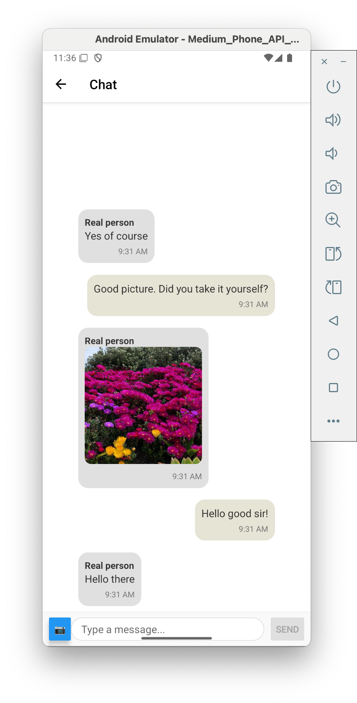
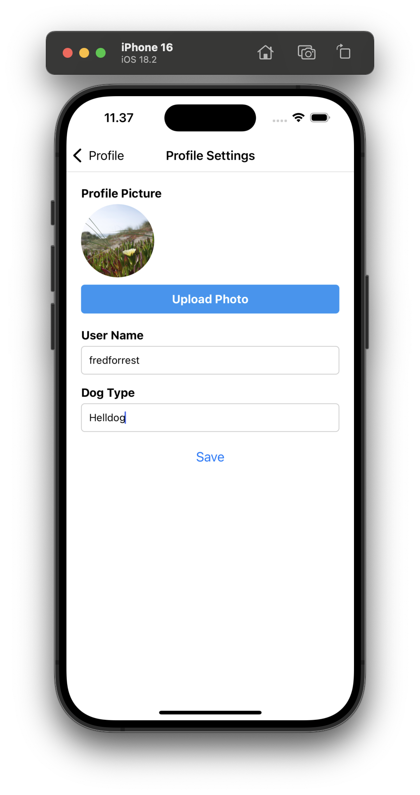
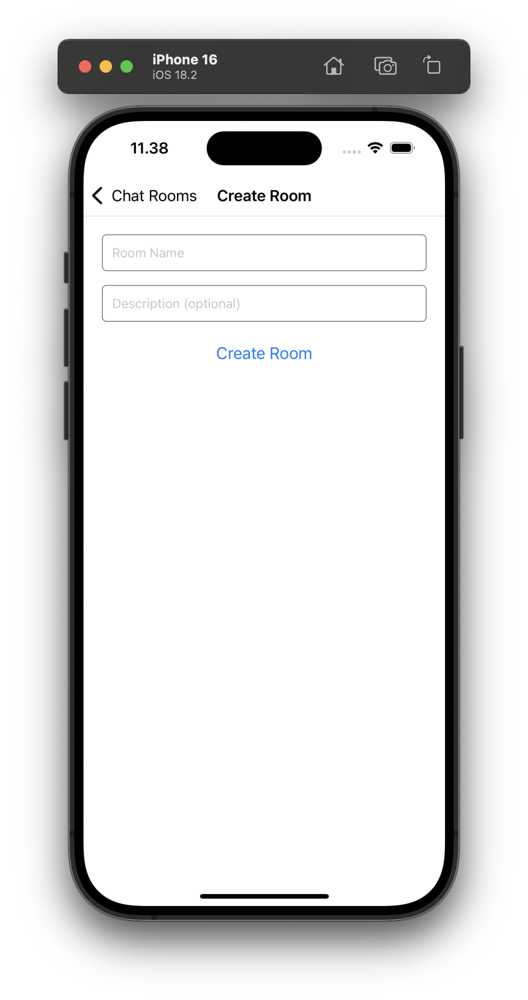

Woof 🐶 – Social App for Dog Lovers
📱 About the App

Woof is a cross-platform social networking app built for dog lovers. Whether you're looking for doggy playdates, making new friends, or even a human connection, Woof helps dog owners connect through their furry companions.

🌟 Features

    🐕 Create a Profile: Add your name, your dog’s name, breed and photos,

    💬 Chat & Interact: Message other users to arrange meetups.

    🔒 Secure Authentication: Sign up and log in using Google Firebase Authentication (Google and Email)

    ☁️ Cloud Storage: Store and retrieve userdata via Firebase.

🛠️ Tech Stack

    Frontend: React Native "bare-react" + TypeScript

    Backend: Firebase (Firestore, Authentication)

    Cross-Platform: Works on iOS & Android

🚀 Getting Started
1️⃣ Clone the Repository

git clone https://github.com/your-repo/woof.git
cd woof

2️⃣ Install Dependencies

npm install

3️⃣ Set Up Firebase

    Create a Firebase project at Firebase Console.

    Enable Authentication (Google, Email.)

    Set up Cloud Firestore and Storage.

    Download your google-services.json (for Android) and GoogleService-Info.plist (for iOS).

    Place them in the correct locations inside your project.

4️⃣ Run the App

For Android:

npm run android

For iOS (Mac required):

npm run ios

🤝 Contributing

Have ideas or improvements? Open an issue or submit a pull request!

📜 License

This project is licensed under the MIT License.
## 🖼️ Screenshots

  
  

  
  

  
  

  

